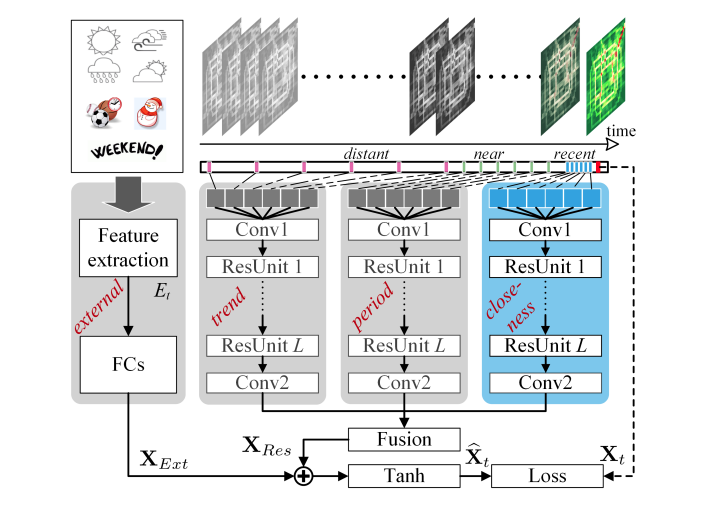
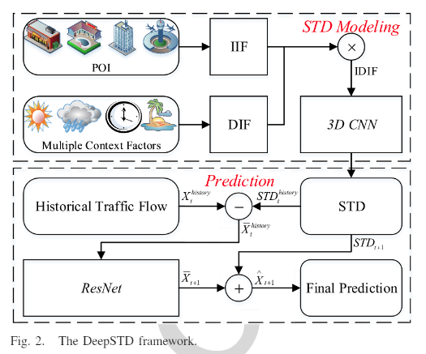
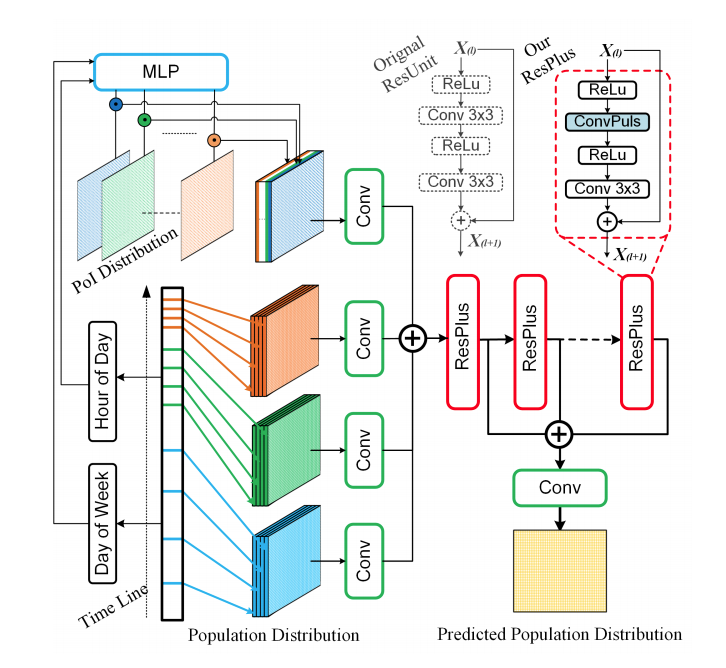
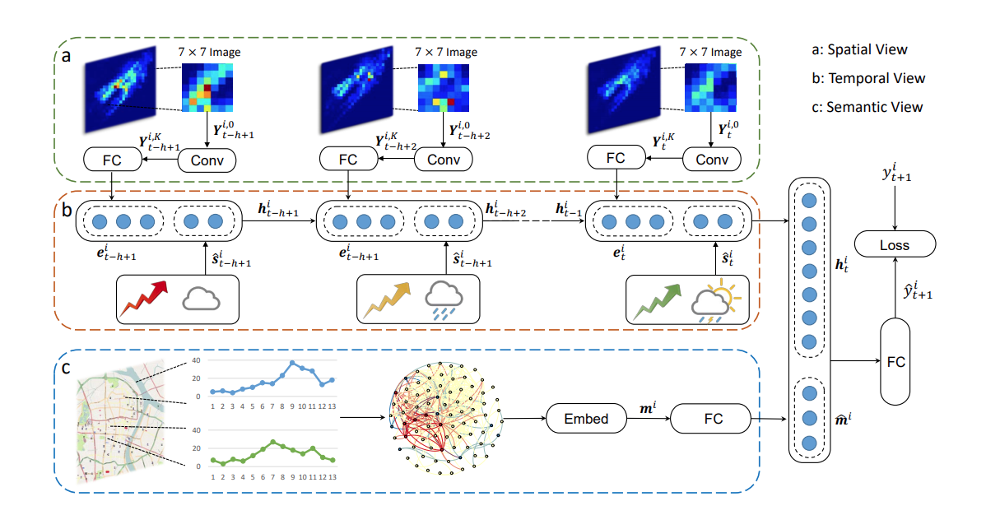

# Spatiotemporal-Model
存储时序数据预测的相关模型的复现，基于tensorflow 2.0 实现
本仓库仅包含模型部分，对于数据的处理部分参考相关论文

1. **Deep Spatio-Temporal Residual Networks for Citywide Crowd Flows Prediction**     

|   模型    | 创新点 |                             框架                             | Github                         |
| :-------: | :----: | :----------------------------------------------------------: | ------------------------------ |
| ST-ResNet |        |  | [code](/ST_ResNet)  [papper]() |

*Junbo Zhang, Yu Zheng, Dekang Qi*

------

2. **DeepSTD: Mining Spatio-Temporal Disturbances of Multiple Context Factors for Citywide Traffic Flow Prediction**  

|   模型    | 创新点 |                             框架                             | Github                         |
| :-------: | :----: | :----------------------------------------------------------: | ------------------------------ |
| ST-ResNet |        |  | [code](/ST_ResNet)  [papper]() |

*Chuanpan Zheng , Xiaoliang Fan, Chuanpan Zheng, Xiaoliang Fan*

------

3. **ASTIR: Spatio-Temporal Data Mining for Crowd Flow Prediction**     

| 模型  | 创新点 |                             框架                             | Github                         |
| :---: | :----: | :----------------------------------------------------------: | ------------------------------ |
| ASTIR |        |  | [code](/ST_ResNet)  [papper]() |

*Lablack Mourad, Heng Qi , Yanming Shen, Baocai Yin*

------

4. **DeepSTN+: Context-aware Spatial-Temporal Neural Network for Crowd Flow Prediction in Metropolis**     

|   模型   | 创新点 |                             框架                             | Github                         |
| :------: | :----: | :----------------------------------------------------------: | ------------------------------ |
| DeepSTN+ |        |  | [code](/ST_ResNet)  [papper]() |

*Ziqian Lin, Jie Feng, Ziyang Lu, Yong Li, Depeng Jin*

------

5. **Deep Multi-View Spatial-Temporal Network for Taxi Demand Prediction**  

| 模型  | 创新点 |                             框架                             | Github                         |
| :---: | :----: | :----------------------------------------------------------: | ------------------------------ |
| DMVST |        |  | [code](/ST_ResNet)  [papper]() |

*Huaxiu Yao, Fei Wu, Jintao Ke, Xianfeng Tang*

6. **Flow Prediction in Spatio-Temporal Networks Based on Multitask Deep Learning**     

| 模型 | 创新点 |                             框架                             | Github             |
| :--: | :----: | :----------------------------------------------------------: | ------------------ |
| MDL  |        |  | [code](/ST_ResNet) |

*Junbo Zhang, Yu Zheng, Junkai Sun, Dekang Qi*

7. **DeepSTN+: Context-aware Spatial-Temporal Neural Network for Crowd Flow Prediction in Metropolis**     

|   模型   | 创新点 |                             框架                             | Github             |
| :------: | :----: | :----------------------------------------------------------: | ------------------ |
| DeepSTN+ |        |  | [code](/ST_ResNet) |

*Ziqian Lin, Jie Feng, Ziyang Lu, Yong Li, Depeng Jin*

------

